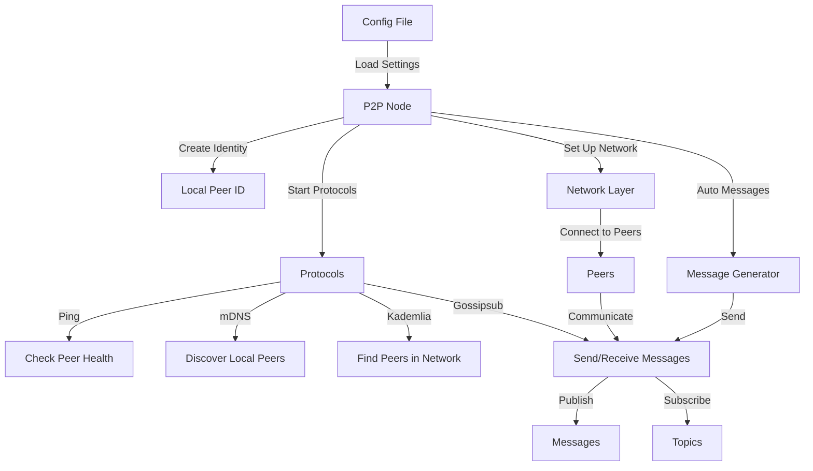

```mermaid
graph TD
    A[Config File] -->|Load Settings| B[P2P Node]
    B -->|Create Identity| C[Local Peer ID]
    B -->|Set Up Network| D[Network Layer]
    D -->|Connect to Peers| E[Peers]
    B -->|Start Protocols| F[Protocols]
    F -->|Ping| G[Check Peer Health]
    F -->|mDNS| H[Discover Local Peers]
    F -->|Kademlia| I[Find Peers in Network]
    F -->|Gossipsub| J[Send/Receive Messages]
    J -->|Publish| K[Messages]
    J -->|Subscribe| L[Topics]
    E -->|Communicate| J
    B -->|Auto Messages| M[Message Generator]
    M -->|Send| J
```
